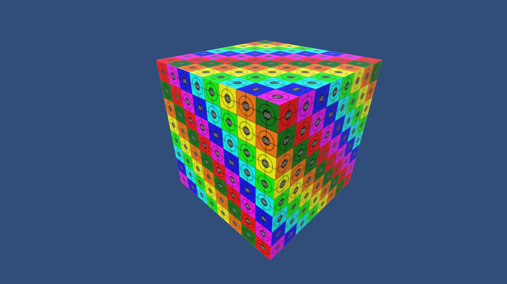

# ProceduralCube

I created this procedural cube in Unity as an reminder for myself. It's a code stub (pretty much) which could be later repurposed for some real use-case.

Test texture used in this is not included, it's something I just grabbed from Google image search to test this out.

Unity version: 2018.4, but it should work ok in later versions.

## Details

- Separate faces with unique vertices for each "quad".
- Correct, non-flipped UV coordinates.
- Normals manually assigned (RecalculateNormals could be used in this case, but I wrote this as an reminder.)
- Demo setup assigns a texture (configure it in Inspector.)
- and it assigns a material (built-in pipeline Standard material.)

